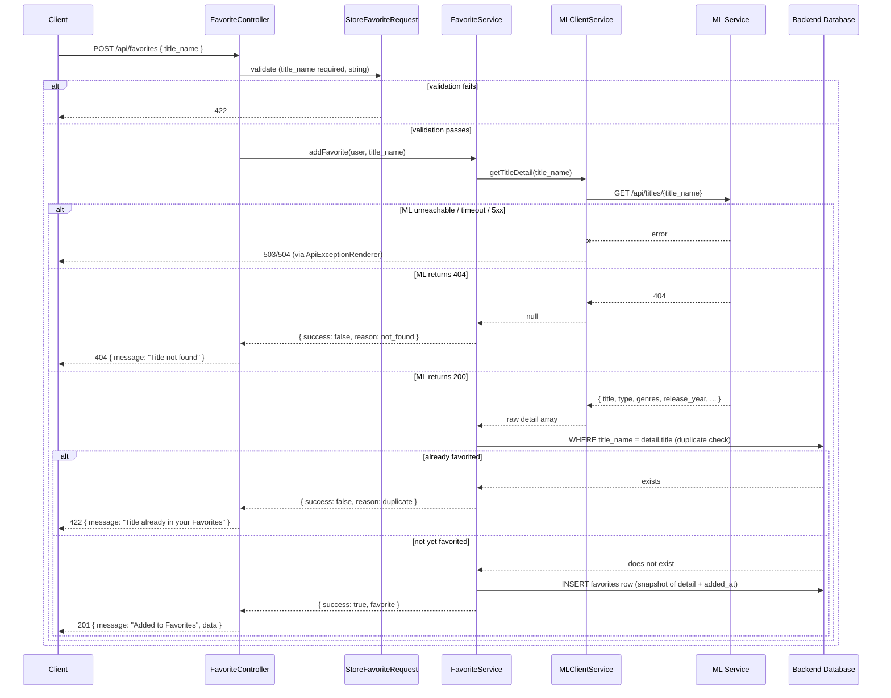

# ML Integration Contract — Favorites

**Audience:** AI/ML Engineer implementing or maintaining the ML service (`ml/recommender_service.py` and its FastAPI wrapper).
**Backend feature:** Favorites (`docs/features/02_feature-favorites/`)
**Backend files implementing this contract:**
- `app/Http/Controllers/Api/FavoriteController.php`
- `app/Services/FavoriteService.php`
- `app/Services/MLClientService.php` (method: `getTitleDetail()`)
- `app/Http/Requests/StoreFavoriteRequest.php`
- `app/Http/Resources/FavoriteResource.php`
- `app/Enums/TitleType.php`

Only **one** of the three Favorites endpoints talks to the ML layer: `POST /api/favorites`. `GET /api/favorites` and `DELETE /api/favorites/{title_name}` never call ML — they operate purely on data already stored in the Backend's own database.

---

## 1. Feature Overview

Favorites lets an authenticated user save a title to a personal list. The Backend has no independent catalog of valid titles or their metadata (genres, type, release year) — that data exists only in the ML layer's dataset. When a user adds a favorite, the Backend must ask the ML layer "does this title exist, and if so, what is its canonical metadata?" before it can persist anything.

The ML model solves two problems here: (1) **title validation** — rejecting an add-to-favorites request for a title that doesn't exist in the dataset, and (2) **canonical metadata resolution** — the user may type a title with different casing or a partial match, and the Backend needs the ML layer's authoritative title string and metadata to store.

---

## 2. Backend → ML Request

- **Triggering Backend endpoint:** `POST /api/favorites` (protected — requires a valid Bearer/JWT token)
- **Backend controller:** `App\Http\Controllers\Api\FavoriteController::store()`
- **Backend service that calls ML:** `App\Services\FavoriteService::addFavorite(User $user, string $titleName)`
- **Backend service method called:** `MLClientService::getTitleDetail(string $title)`
- **ML endpoint called:** `GET {ML_BASE_URL}/api/titles/{title}`
- **When executed:** On every `POST /api/favorites` request that passes `StoreFavoriteRequest` validation (i.e. `title_name` is present and is a string) — the ML call happens **before** any database read or write. It is the very first thing `addFavorite()` does.
- **Skipped when:**
  - The request fails `StoreFavoriteRequest` validation (`title_name` missing or not a string) — ML is never called, Backend returns `422` immediately.
  - There is **no** short-circuit for an already-favorited title — the ML call happens even if the user has already favorited that exact title; the duplicate check happens locally, **after** the ML call returns (see §7).

This is a **write-path, snapshot-at-write** integration: the ML-returned metadata (`type`, `genres`, `release_year`) is copied into the Backend's own `favorites` table row at creation time and is **never re-fetched from ML again** for that favorite. Listing favorites (`GET /api/favorites`) reads only the locally stored snapshot; it does not call ML.

---

## 3. Request Payload

### 3.1 Backend's own inbound contract (client → Backend)

| Property | Value |
|---|---|
| HTTP Method | `POST` |
| Endpoint | `/api/favorites` |
| Content-Type | `application/json` |
| Authentication | Required — `Authorization: Bearer {jwt}` |

```json
{
  "title_name": "Breaking Bad"
}
```

| Field | Type | Required | Description |
|---|---|---|---|
| `title_name` | string | Yes | The title the client wants to favorite, as typed/selected by the end user (e.g. from a search-autocomplete result) |

**Backend validation** (`StoreFavoriteRequest::rules()`):
```php
'title_name' => ['required', 'string'],
```
No length constraints, no format constraints beyond "must be a string." This raw string is what gets forwarded to ML.

### 3.2 Backend → ML request (what this document is actually specifying)

| Property | Value |
|---|---|
| HTTP Method | `GET` |
| Content-Type | N/A (no body) |
| Authentication | None sent to ML |
| Headers | Standard Laravel HTTP client defaults only |

**Path Parameter**

| Field | Type | Required | Description |
|---|---|---|---|
| `title` | string (URL segment) | Yes | The client's raw `title_name` input, forwarded to ML verbatim — no trimming, no case normalization, no encoding beyond standard URI construction performed by the Backend |

**Example request:** `GET {ML_BASE_URL}/api/titles/Breaking Bad`

No query parameters on this call.

---

## 4. Expected ML Response

`200 OK`:

```json
{
  "title": "Breaking Bad",
  "type": "TV Show",
  "genres": "Crime, Drama, Thriller",
  "rating": "TV-MA",
  "country": "United States",
  "release_year": 2008,
  "director": "Not Given"
}
```

| Field | Type | Required | Nullable | Used by this feature? |
|---|---|---|---|---|
| `title` | string | Yes | No | **Yes** — becomes the canonical `title_name` stored in the database (not the user's raw input — see §7) |
| `type` | string | Yes | No | **Yes** — must be exactly `"Movie"` or `"TV Show"`; mapped to `App\Enums\TitleType` and stored |
| `genres` | string | Yes | No | **Yes** — stored **verbatim as the comma-separated string**, unlike Search & Discovery's title-detail endpoint, this feature does **not** split genres into an array; it is persisted to the database exactly as ML sent it |
| `rating` | string | Yes | No | **No** — read is not even attempted; this field is entirely ignored by this feature |
| `country` | string | Yes | No | **No** — ignored |
| `release_year` | integer | Yes | No | **Yes** — stored as-is |
| `director` | string | Yes | No | **No** — ignored |

`404 Not Found` — body per `ml/API_CONTRACT.md`: `{"detail": "Title not found"}`. The Backend does not read the body of a 404 at all (see §5).

---

## 5. Backend Validation Rules

- The **only** status code the Backend treats specially is `404` (see §6 for what happens then).
- On any status that is not `404` and not a `5xx` (i.e. `200`, or an unexpected `2xx`/`4xx`), the Backend calls `$response->json()` unconditionally and treats the result as valid title data:
  - `$detail = $this->mlClientService->getTitleDetail($titleName);`
  - `if ($detail === null) { return ['success' => false, 'reason' => 'not_found']; }`
  - A malformed/non-JSON `200` body → `$response->json()` returns `null` → treated **identically to a 404** ("Title not found" returned to the client). This is a real, implemented fallback behavior, not an edge case the Backend explicitly guards against by name.
- **Required fields actually dereferenced** (no others are read, so no others are validated): `title`, `type`, `genres`, `release_year`. If any of these four keys is absent from an otherwise-valid JSON body:
  - Missing `title`, `genres`, or `release_year` → PHP throws on the missing array key (uncaught → `500` via the global exception handler).
  - Missing or unrecognized `type` (i.e. present but not exactly `"Movie"` or `"TV Show"`) → `App\Enums\TitleType::fromLabel()` throws a `ValueError` (uncaught → `500`).
- **No type-checking is performed** — if `release_year` arrives as a string instead of an integer, or `genres` arrives as an array instead of a string, the Backend does not detect or reject this; it is written to the database as-is (Eloquent's `release_year` cast will attempt to coerce it to an integer, `genres` has no cast and would be stored as whatever PHP type `json_decode` produced, which for a non-string value could fail at the database write step depending on driver strictness).

---

## 6. Error Handling

`getTitleDetail()` uses the same shared `get()` HTTP wrapper described in `search-discovery.md` §6. Reproduced here for this feature's specific consequences:

| Condition | Backend behavior | HTTP status returned to the Backend's client |
|---|---|---|
| ML unreachable (connection refused, DNS failure) | `MlConnectionException` thrown from `MLClientService::get()`, propagates **uncaught through `FavoriteService::addFavorite()` and `FavoriteController::store()`**, caught centrally by `App\Exceptions\ApiExceptionRenderer` | `503`, `{"status":"error","message":"Service not available right now"}` |
| ML times out (> `ML_TIMEOUT` seconds, default 10s) | `MlTimeoutException` thrown, same propagation path | `504`, `{"status":"error","message":"Service took too long"}` |
| ML returns any `5xx` | Treated identically to "unreachable" — `MlConnectionException` | `503`, same as above |
| ML returns `404` | Not an exception — `getTitleDetail()` returns `null`, `FavoriteService::addFavorite()` returns `['success' => false, 'reason' => 'not_found']` | `404`, `{"status":"error","message":"Title not found"}` |
| ML returns any other 4xx (`400`, `401`, `403`, `409`, `422`, `429`, etc.) | **Not treated as an error at all.** Response body is parsed as if it were valid title data (see §5) | Whatever the (mis)parsed data produces — most likely `500` from a missing-field error, or in the worst case a favorite silently created from garbage/error-body data if the error JSON happens to coincidentally contain `title`/`type`/`genres`/`release_year` keys |
| ML returns invalid/non-JSON body on `200` | `$response->json()` → `null` → treated as `not_found` | `404`, `{"status":"error","message":"Title not found"}` |
| Valid JSON, but a required field missing or `type` unrecognized | Uncaught PHP error, caught by global exception handler's catch-all | `500` |

**Critically:** unlike the Home feature, there is **no graceful degradation** here. If ML is down, the user simply cannot add a favorite during that window — the request fails outright with `503`/`504`. This is an intentional design choice appropriate for a write operation that requires authoritative title data (contrast with Home, a read-only feed that must never hard-fail).

---

## 7. Backend Post-processing

After a successful ML response, `FavoriteService::addFavorite()` performs the following, in order:

1. **Canonicalization:** the favorite is keyed by `$detail['title']` (the ML-returned canonical title), **not** the user's raw `title_name` input. If a user types `"breaking bad"` and ML resolves it (exact or partial match) to `"Breaking Bad"`, the Backend stores `"Breaking Bad"`.
2. **Duplicate check (post-ML, pre-write):** `$user->favorites()->where('title_name', $detail['title'])->exists()`. This check uses the **ML-resolved canonical title**, not the raw input — two different raw inputs that both resolve to the same canonical ML title will correctly collide as duplicates. If a match is found, the Backend returns `['success' => false, 'reason' => 'duplicate']` **without writing anything**, and **without discarding the ML call already made** (the ML call is not wasted-avoided by checking duplicates first — see §2).
3. **Type mapping:** `App\Enums\TitleType::fromLabel($detail['type'])` — maps the ML string literal to the Backend's internal enum. Throws `ValueError` for any value other than `"Movie"`/`"TV Show"` (see §5).
4. **Snapshot write:** a new `favorites` row is created with `title_name`, `title_type`, `genres` (raw comma-string, unsplit), `release_year` — all taken directly from the ML response — plus `added_at = now()` (a Backend-generated timestamp, not from ML) and the authenticated `user_id`.
5. **No filtering, ranking, merging, sorting, or deduplication against other data** occurs beyond the single duplicate check above — this is a single-title write, not a list-processing operation.

---

## 8. Performance Notes

- **No caching.** Every `POST /api/favorites` request results in exactly one live ML call, even for a title that was just looked up seconds ago (by this user or another).
- **No parallelism** — a single title, a single request.
- **No retry strategy** — one failed attempt fails the whole operation.
- **No batching** — this is a single-item write endpoint.
- Rate limiting is enforced Backend-side on the route (`throttle:protected`, 100 requests/minute per authenticated user) — irrelevant to the ML service's own load characteristics beyond capping the maximum call rate from any one user.

---

## 9. Sequence Diagram



---

## 10. Backend Expectations

- **`type` must be exactly `"Movie"` or `"TV Show"`** — any other value causes an uncaught `ValueError` and a `500` response, failing the user's add-to-favorites action entirely.
- **`genres` must be a string** (comma-separated) — it is persisted verbatim, with no splitting, no validation of its internal format. Any string value is accepted and stored as-is, including malformed or empty strings.
- **`release_year` must be an integer** (or at least a value Eloquent's integer cast can coerce).
- **`title` is treated as the single source of truth for "what this title is called."** Whatever string ML returns here becomes permanently stored in the Backend's database for this favorite and is what future duplicate-detection, unfavoriting (by title name), and display will use — ML must be consistent in what canonical title string it returns for a given input across repeated calls, or duplicate-detection and title-based deletion will behave unpredictably for the same logical title.
- **`404` is the only status meaning "this title does not exist."** Any other non-2xx/non-5xx status is not interpreted as "not found" and will not produce the clean `404 Title not found` client response — it risks either a `500` or, in the worst case, corrupted data being written.
- **The ML dataset is the sole authority on title existence** — the Backend has no fallback list and cannot validate a title on its own if ML is unavailable (see §6, no graceful degradation on this write path).

---

## 11. Integration Checklist

- [ ] `GET /api/titles/{title}` returns `200` with all of `title`, `type`, `genres`, `release_year` present for any title that exists in the dataset (this feature ignores `rating`, `country`, `director`, but they should still be present per `search-discovery.md`'s contract since other features consume them)
- [ ] `type` is exactly `"Movie"` or `"TV Show"`
- [ ] `genres` is a comma-separated string, not an array, not `null`, not omitted
- [ ] `release_year` is a JSON integer, not a numeric string
- [ ] `title` is returned with **stable, consistent canonical casing** across repeated calls for the same logical title — this directly affects duplicate detection correctness
- [ ] `GET /api/titles/{title}` returns `404` (not `200` with empty body, not `400`) when the title genuinely doesn't exist
- [ ] Partial-match resolution (if the ML service supports it) returns the **full canonical title**, not the user's partial input, in the `title` field
- [ ] Response time is consistently within `ML_TIMEOUT` (Backend default 10s) — this is a synchronous, blocking call on the user-facing "add favorite" action
- [ ] No `5xx` is ever returned for a legitimate "not found" — only for genuine service errors
