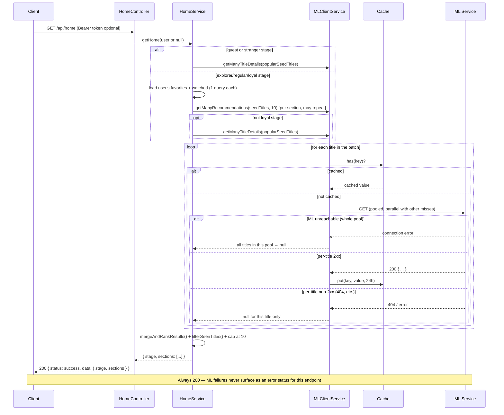

# ML Integration Contract — Home

**Audience:** AI/ML Engineer implementing or maintaining the ML service (`ml/recommender_service.py` and its FastAPI wrapper).
**Backend feature:** Home (`docs/features/04_feature-home/`)
**Backend files implementing this contract:**
- `app/Http/Controllers/Api/HomeController.php`
- `app/Services/HomeService.php`
- `app/Services/MLClientService.php` (methods: `getManyTitleDetails()`, `getManyRecommendations()`)

This is the **only** feature that uses the Backend's batched/parallel/cached ML client methods. Every other feature (`search-discovery.md`, `favorites.md`, `watched-titles.md`) uses the single-item, uncached, exception-throwing methods. Home is also the **only** feature where an ML failure never surfaces as an error response to the client — everything degrades silently. This is the most complex ML integration in the system; read this document in full before implementing against it.

---

## 1. Feature Overview

Home renders the personalized landing feed (`GET /api/home`), composed of 1–3 named "sections" (e.g. "Popular on Netflix", "Handpicked For You", "Because You Watched X"), each containing a list of title cards. Which sections appear and how many ML seed titles feed each one depends on the user's "stage" (`stranger` / `explorer` / `regular` / `loyal`), computed from `signalCount = count(favorites) + count(watched_titles)` at request time (never persisted).

The ML model solves the core personalization problem: given one or more "seed" titles the user has expressed interest in (via Favorites or Watch History), return other titles similar to those seeds. The Backend has no independent notion of title similarity — every non-empty section on this page is either directly built from an ML recommendation response, or (for "Popular") built from ML title-detail lookups against a fixed, curated seed list, since **the ML service exposes no dedicated popularity/trending endpoint** (confirmed against `ml/API_CONTRACT.md` — only `/api/search`, `/api/titles/{title}`, `/api/recommend/{title}` exist).

---

## 2. Backend → ML Request

- **Triggering Backend endpoint:** `GET /api/home` (public — Bearer token optional; presence of a valid token changes the response but is never required)
- **Backend controller:** `App\Http\Controllers\Api\HomeController::__invoke()`
- **Backend service that calls ML:** `App\Services\HomeService` — specifically its private `safeGetManyRecommendations()` and `safeGetManyTitleDetails()` wrappers
- **Backend client methods called:** `MLClientService::getManyRecommendations(array $titles, int $n = 10)` and `MLClientService::getManyTitleDetails(array $titles)`
- **ML endpoints called:** `GET {ML_BASE_URL}/api/recommend/{title}?n={n}` (once per seed title, in parallel) and `GET {ML_BASE_URL}/api/titles/{title}` (once per popular-pool title, in parallel)
- **When executed:** On every `GET /api/home` request, subject to the per-section conditions in §2.1–§2.5 below and the caching behavior in §8. **Zero, one, or multiple** underlying HTTP calls to ML may occur per Backend request depending on cache state and user stage.

### 2.1 Guest or "stranger" stage (`signalCount == 0`)

- Exactly **one** batched call: `getManyTitleDetails($popularSeedTitles)` where `$popularSeedTitles` is the fixed 11-title list in §2.6.
- No recommendation calls are made at all.

### 2.2 "explorer" stage (`signalCount` 1–4)

- If the user has **at least 1 Favorite**: one batched recommendation call seeded with **only their single most-recently-added Favorite** (`getManyRecommendations([$mostRecentFavorite], 10)`).
- If the user has **zero Favorites** (signals came entirely from Watched Titles): **no recommendation call is made at all** — the personalized section is skipped entirely, ML is only called for the popular pool.
- Always followed by one `getManyTitleDetails($popularSeedTitles)` call for the "Popular" section.

### 2.3 "regular" stage (`signalCount` 5–19)

- If the user has **at least 1 Favorite**: one batched recommendation call seeded with their **3 most-recently-added Favorites** (fewer than 3 if they have fewer than 3 total).
- If the user has **at least 1 Watched Title**: one **separate** batched recommendation call seeded with **only their single most-recently-watched title**.
- Either or both of the above may be skipped if the corresponding source list (Favorites / Watched Titles) is empty.
- Always followed by one `getManyTitleDetails($popularSeedTitles)` call.

### 2.4 "loyal" stage (`signalCount` ≥ 20)

- If the user has **at least 1 Favorite**: one batched recommendation call seeded with their **5 most-recently-added Favorites**.
- If the user has **at least 1 Favorite**: one **separate** batched recommendation call seeded with **only their single all-time-oldest Favorite** (their first-ever Favorite — see `home.md`'s source feature doc for rationale).
- One further batched recommendation call seeded with either:
  - their **6th–10th most-recently-added Favorites** (if they have more than 5 Favorites), or
  - a fallback of the **first 3 titles from the fixed popular-seed list** (§2.6) if they have 5 or fewer Favorites.
- **No `getManyTitleDetails` / "Popular" call is made at all for loyal users** — this stage never shows a Popular section.

### 2.5 Conditions under which the request is skipped entirely

- A personalized/because-you-watched/because-you-loved/new-for-you recommendation call is skipped **only** when its seed source (Favorites and/or Watched Titles, per stage) is completely empty for that specific seed role — never based on any other condition.
- The Popular title-detail call is skipped **only** for the "loyal" stage — it is unconditional for every other stage (including guests).
- **No ML call of any kind is skipped due to caching** at the `HomeService` level — caching happens one layer down, inside `MLClientService`, and is transparent to `HomeService` (see §8). From `HomeService`'s perspective, it always "calls" `MLClientService`; whether that results in a live HTTP request is decided internally by `MLClientService`.

### 2.6 The fixed "Popular" seed list

Because no ML popularity endpoint exists, the Backend hardcodes this exact 11-title list (`HomeService::POPULAR_SEED_TITLES`) and resolves each via `getManyTitleDetails()`:

```
Breaking Bad, Stranger Things, The Crown, Narcos, Ozark, Better Call Saul,
Peaky Blinders, House of Cards, Dark, The Witcher, Black Mirror
```

**These exact strings must resolve successfully via `GET /api/titles/{title}`** (exact or ML's own partial-match logic) against the ML service's dataset, or the "Popular" section will silently render with fewer items (see §7). This list is static Backend configuration, not sent as a parameter ML can influence — if the ML service's underlying dataset changes such that any of these titles no longer resolve, the Backend will not automatically adapt; only a Backend code change updates this list.

### 2.7 Shared HTTP client configuration

Identical underlying client to every other feature — same `ML_BASE_URL` / `ML_TIMEOUT` env vars, same lack of auth headers. The only difference for this feature is that calls are issued via `Http::pool()` (parallel) instead of one-at-a-time, and are wrapped with a cache-first check (see §8).

---

## 3. Request Payload

### 3.1 `GET /api/recommend/{title}?n={n}` (per seed title, called in parallel via `Http::pool()`)

| Property | Value |
|---|---|
| HTTP Method | `GET` |
| Content-Type | N/A (no body) |
| Authentication | None sent to ML |

**Path Parameter**

| Field | Type | Required | Description |
|---|---|---|---|
| `title` | string (URL segment) | Yes | A seed title — either a user's Favorite/Watched title name (exactly as stored in the Backend's database, which itself came from a prior ML `getTitleDetail()` response — see `favorites.md`/`watched-titles.md`), or one of the fixed strings in §2.6 |

**Query Parameters**

| Field | Type | Required | Value used by this feature |
|---|---|---|---|
| `n` | integer | Yes (always sent) | Always exactly `10` — `HomeService::SECTION_ITEM_LIMIT`. Never any other value, never omitted, never client-controlled (unlike Search & Discovery's `/api/recommendations/{title}` endpoint where `n` is client-supplied) |

**Example (one of several parallel requests in a single pool):** `GET {ML_BASE_URL}/api/recommend/Breaking Bad?n=10`

**How many of these fire per `GET /api/home` request:** between 0 and 3, depending on stage (see §2.1–§2.4) — each one is itself a **single HTTP request covering one seed title**; when a stage uses multiple seeds for the *same* section (e.g. regular's 3-favorite personalized section), all seeds for that section are sent as **separate parallel requests within one `Http::pool()` call**, not combined into one request.

### 3.2 `GET /api/titles/{title}` (per popular-pool title, called in parallel via `Http::pool()`)

| Property | Value |
|---|---|
| HTTP Method | `GET` |
| Content-Type | N/A (no body) |
| Authentication | None sent to ML |

**Path Parameter**

| Field | Type | Required | Description |
|---|---|---|---|
| `title` | string (URL segment) | Yes | One of the 11 fixed strings in §2.6 |

No query parameters.

**How many of these fire:** up to 11 in parallel (fewer if some are already cached — see §8), once per `GET /api/home` request, for every stage except loyal.

---

## 4. Expected ML Response

Both endpoints' response shapes are **identical to their single-item counterparts** documented in `search-discovery.md` §4.2 and §4.3 — reproduced here for completeness since this document must be self-sufficient.

### 4.1 `GET /api/recommend/{title}?n=10` → `200 OK`

```json
{
  "query": "Breaking Bad",
  "matched_title": "Breaking Bad",
  "total": 10,
  "results": [
    {
      "rank": 1,
      "title": "Better Call Saul",
      "type": "TV Show",
      "genres": "Crime, Drama",
      "rating": "TV-MA",
      "country": "United States",
      "release_year": 2015,
      "director": "Not Given",
      "similarity": 0.98
    }
  ]
}
```

| Field | Type | Required | Used by Home? |
|---|---|---|---|
| `query` | string | Yes | No — read but never used by Home's own logic (Home keys its internal results map by the *input* title it sent, not by echoing this field) |
| `matched_title` | string | Yes | No — unused |
| `total` | integer | Yes | No — unused |
| `results` | array | Yes | **Yes** — this is the only field Home reads |
| `results[].title` | string | Yes | **Yes** — used as the merge/dedup key (case-insensitively) and shown to the client |
| `results[].type` | string | Yes | **Yes** — shown to the client verbatim (expected `"Movie"`/`"TV Show"`, but Home does **not** map it through `TitleType::fromLabel()` — it is passed through as a raw string with no enum validation, unlike Favorites/Watched Titles) |
| `results[].genres` | string | No | **No** — never read by Home |
| `results[].rating` | string | No | **No** — never read |
| `results[].country` | string | No | **No** — never read |
| `results[].release_year` | integer | Yes | **Yes** — shown to the client verbatim |
| `results[].director` | string | No | **No** — never read |
| `results[].similarity` | float | Yes | **Yes** — used for ranking (see §7) and shown to the client as `similarity_score`, rounded to 4 decimal places, potentially recency-weighted (multiplied by a Backend-computed weight, see §7) before being averaged and shown — **the exact number the client sees is not the raw ML value** |
| `results[].rank` | integer | No | **No** — never read (Home computes its own ranking independently) |

### 4.2 `GET /api/titles/{title}` → `200 OK`

```json
{
  "title": "Breaking Bad",
  "type": "TV Show",
  "genres": "Crime, Drama, Thriller",
  "rating": "TV-MA",
  "country": "United States",
  "release_year": 2008,
  "director": "Not Given"
}
```

| Field | Type | Required | Used by Home? |
|---|---|---|---|
| `title` | string | Yes | **Yes** — shown to the client, used for the seen-title filter (see §7) |
| `type` | string | Yes | **Yes** — shown to the client verbatim, no enum validation |
| `genres` | string | Yes | **No** — never read by Home (contrast with Search & Discovery's title-detail endpoint, which does split and forward it) |
| `rating` | string | Yes | **No** — never read |
| `country` | string | Yes | **No** — never read |
| `release_year` | integer | Yes | **Yes** — shown to the client verbatim |
| `director` | string | Yes | **No** — never read |

`404 Not Found` on either endpoint — see §5/§6 for how this specifically behaves in the batched/parallel path (materially different from the single-item path in the other three features).

---

## 5. Backend Validation Rules

This is the area where Home's contract diverges most sharply from the other three features. The batched `poolCached()` method in `MLClientService` applies the **same success criterion to every individual title in the pool**, independently:

```php
$data = $response instanceof Response && $response->successful() ? $response->json() : null;
```

- `$response->successful()` means **any `2xx` status** — this is a materially different (and stricter) check than the single-item methods, which only special-case `404` and otherwise accept any status.
- Any status that is **not** `2xx` (including `404`, `400`, `422`, `500`, etc.) for an **individual title within the pool** results in `null` for that title — there is no distinction in the batched path between "not found" and "malformed request" and "server error" **at the per-title level**. All non-2xx outcomes for one title in the pool degrade identically: that title is simply dropped, `HomeService` treats it as if ML had no data for that seed/title, and the request continues processing the rest of the pool normally.
- If the response body is not valid JSON on a `2xx` status, `$response->json()` returns `null`, which is **explicitly checked** — `if ($data !== null) { Cache::put(...); }` — so a malformed `2xx` body is correctly **not cached** (unlike the single-item title-detail path used by Favorites/Watched Titles, which would misinterpret this as "not found" and cache nothing either, coincidentally arriving at the same non-caching outcome via different logic).
- Within `HomeService`, once a per-title/per-seed response is obtained (or is `null`):
  - For recommendation responses: `$response['results'] ?? []` — a missing or `null` `results` key is tolerated and treated as an empty list, **not** an error. This is more defensive than Search & Discovery's `/api/recommendations/{title}` endpoint, which throws uncaught on a missing `results` key.
  - Individual result items are trusted to have `title`, `type`, `release_year`, `similarity` with no defensive checks — a missing field on any individual recommendation item will throw a PHP warning/error when that item is later mapped to the client response shape (uncaught — see §6).
  - For title-detail responses: `collect(...)->filter()` drops any `null` entries (failed lookups) automatically; surviving entries are trusted to have `title`, `type`, `release_year`.

**Summary — what Home accepts without complaint:** any `2xx` response with valid JSON, even if `results` is absent (recommendations) — it's treated as zero results, not an error. **What Home silently drops (never surfaces as an error to the end user):** any non-`2xx` response, any invalid-JSON `2xx` response, and (at the whole-pool level) total ML unreachability.

---

## 6. Error Handling

This is Home's defining characteristic: **`GET /api/home` never returns a non-2xx status because of an ML problem.** Every failure mode degrades to "this section has less content" or "this section is missing," never to an HTTP error.

Two layers of defense exist:

### 6.1 Layer 1 — `MLClientService::poolCached()` (per-pool, whole-pool failure)

```php
try {
    $responses = Http::pool(...);
} catch (Throwable) {
    // every pending title in this pool → null
}
```

If the pool call itself throws **any** `Throwable` (e.g. the ML host is completely unreachable such that even establishing connections for the pool fails), **every title in that specific pool** is marked `null`. Titles already served from cache before the pool was even attempted are unaffected. This catch is intentionally broad (`Throwable`, not a specific exception type) since `Http::pool()`'s failure modes are not narrowly typed.

### 6.2 Layer 2 — `HomeService::safeGetManyRecommendations()` / `safeGetManyTitleDetails()` (defensive, catches Backend-specific exceptions)

```php
try {
    return $this->mlClientService->getManyRecommendations($titles, self::SECTION_ITEM_LIMIT);
} catch (MlConnectionException|MlTimeoutException) {
    return array_fill_keys($titles, null);
}
```

This second layer specifically catches `MlConnectionException`/`MlTimeoutException` — the same exception types the single-item methods throw. **In the current implementation, `poolCached()` itself never actually throws these two specific exception types** (it catches the generic `Throwable` internally and returns nulls, per §6.1, before any `MlConnectionException`/`MlTimeoutException` could propagate). This second try/catch layer is therefore currently defensive/redundant against the live code path, but it is real, present, tested code — the AI Engineer should not assume it is dead: it guards against any future change to `poolCached()`'s internals that might let these specific exceptions propagate.

### 6.3 Resulting behavior table

| Condition | What happens inside `HomeService` | What the end user sees |
|---|---|---|
| Entire ML service unreachable for an entire request | Every pool called during that request returns all-`null` for its titles | `200 OK`. Every section that depends on a recommendation call is omitted entirely from the `sections` array. The "Popular" section (where applicable) is still present in the array but with `items: []`. **The response is always `200`, never `503`/`504`, for this feature specifically** |
| ML unreachable for only *some* titles in a pool (partial pool failure — not currently distinguished from "whole pool failure" by the implementation, since the try/catch is around the entire `Http::pool()` call) | Same as above for that pool — a partial network-level failure inside one `Http::pool()` call is not currently possible to partially succeed if the exception is thrown before responses are collected; individual **request-level** failures (see next row) are the actual mechanism for partial degradation |
| One specific title within a pool returns `404` (not found in ML's dataset) while others in the same pool succeed | That one title's entry is `null`; the rest of the pool's results are used normally | That title is silently absent from the relevant section's seed data or Popular list — no error, no indication to the client that a title was skipped |
| One specific title within a pool returns a non-404 error status | Same as above — no distinction from a 404 at this layer | Same — silently absent |
| ML response times out for one/all titles | Same degrade-to-`null` behavior (timeouts surface as connection-layer failures within the pool) | Same — silently absent/reduced content |
| A section's ML call(s) all resolve to empty/no usable results | The section-building method (`getPersonalizedSection()`, `getBecauseYouWatchedSection()`, etc.) returns `null` | That section is **omitted from the `sections` array entirely** — not present as an empty-items object (contrast with "Popular," which is always present, possibly with `items: []`) |
| ML fully healthy, all calls succeed | Normal operation | Full personalized feed per the user's stage |

**There is no scenario under which `GET /api/home` returns anything other than `200`, `429` (Backend rate limit, unrelated to ML), or a `500` from a genuinely unexpected Backend bug** (e.g. a missing-field PHP error on a malformed-but-`2xx` item that passed the `null`-body check but is missing a field Home dereferences without a guard — this remains possible and uncaught, same caveat as every other feature).

---

## 7. Backend Post-processing

This is the most involved post-processing pipeline in the system. All of the following happens inside `HomeService`, entirely in PHP, after ML responses are collected.

### 7.1 Merge & rank (`mergeAndRankResults()`)

When a section is seeded from **multiple** titles (e.g. regular/loyal's personalized section with 3–5 Favorite seeds), the recommendation results from **all seeds are pooled together**:

1. For every seed's `results` array, every item is keyed by its **lowercased title**.
2. If the same title appears as a recommendation from more than one seed, its **appearance count** increments and its `similarity` values are summed (see §7.2 for weighting).
3. After merging, entries are sorted **descending by appearance count first, then by average similarity score second** — a title recommended by 2 of 3 seeds always outranks a title recommended by only 1 seed, regardless of that single seed's raw similarity score.

### 7.2 Recency weighting (Loyal stage only, `recencyWeights()`)

For the Loyal stage's "Handpicked For You" section, the 5 Favorite seeds are **not weighted equally**. The most-recently-added Favorite gets weight `1.0`; weight decreases linearly down to `0.5` for the oldest of the 5 seeds (`weight = 1.0 - (index / count) * 0.5`, where `index` is position in newest-first order). Each seed's contribution to the merged similarity sum is multiplied by its weight before averaging. **This means the `similarity_score` shown to the client for the Loyal stage's personalized section is not a raw ML value — it is a recency-weighted average**, rounded to 4 decimal places. Every other stage/section uses an unweighted average (weight `1.0` for all seeds).

### 7.3 Seen-title filtering (`filterSeenTitles()`)

After merging/ranking, every candidate title is checked (case-insensitively) against the **union of the user's own Favorites and Watched Titles** (both fetched once at the start of `getHome()` and reused across every section — a single Backend database query each, not per-section, not per-seed). Any candidate matching a title the user already has in either list is **removed entirely** from the result set before it is capped/returned. This applies uniformly to every recommendation-driven section **and** to the Popular section.

### 7.4 Capping

Every section's final `items` array is capped at exactly **10 entries** (`HomeService::SECTION_ITEM_LIMIT`), applied **after** filtering — so a section may legitimately return fewer than 10 items if fewer than 10 survive the seen-title filter, but never more than 10.

### 7.5 Section presence rules

- A recommendation-driven section (`personalized`, `because_you_watched`, `because_you_loved`, `new_for_you`) is **entirely omitted** from the response's `sections` array if, after merge/rank/filter, its item list is empty — there is no way for the client to distinguish "ML had nothing for this seed" from "everything ML returned was already seen by the user" from "the ML call failed."
- The `popular` section is **always present** for every stage except Loyal (which never includes it), even if its `items` array ends up empty after filtering/failures.

### 7.6 Item shape sent to the client (uniform across all section types)

```json
{ "title": "...", "type": "...", "release_year": 2015, "similarity_score": 0.9123 }
```

`similarity_score` is `null` for every item in the `popular` section (ML's title-detail endpoint has no similarity concept), and a computed float (per §7.1/§7.2) for every recommendation-driven section.

---

## 8. Performance Notes

This is the one feature where caching and parallelism are a first-class, documented part of the contract (`docs/features/04_feature-home/08_home-feature-performance/`).

- **Caching:** every individual title lookup (both `/api/titles/{title}` and `/api/recommend/{title}?n=10`) is cached independently using Laravel's default cache store, for **24 hours**, keyed as:
  - `ml:title:{title}` for title-detail lookups
  - `ml:recommendations:n=10:{title}` for recommendation lookups (the `n` value is part of the key — a cache entry for `n=10` would not be reused for a hypothetical future `n=5` request, though Home always requests `n=10`)
  - Cache keys are **not** normalized (no case-folding, no trimming) — `"Breaking Bad"` and `"breaking bad"` would occupy separate cache entries if both were ever requested with different casing.
  - Only **successful** (`2xx`, valid JSON) responses are cached. A `404`/error/malformed response for a title is **never cached** — meaning a currently-nonexistent title will be re-requested from ML on every single `GET /api/home` call that includes it as a seed, indefinitely, until it starts succeeding.
- **Parallelism:** within one `poolCached()` invocation, all cache-miss titles are requested **simultaneously** via `Http::pool()`, not sequentially. A section needing 5 seed lookups that are all cache-misses issues 5 concurrent HTTP requests, not 5 sequential ones.
- **Batching across sections:** each `HomeService` section-builder method (personalized, because-you-watched, etc.) calls `MLClientService` **separately** — there is no cross-section request coalescing. If two different sections happened to need the same seed title in the same `GET /api/home` request, the **cache** (not request deduplication) is what would prevent a duplicate live HTTP call, since the first section's call would populate the cache before the second section's call checks it (methods run sequentially within `getHome()`, not concurrently with each other).
- **No retry strategy** at any layer — a failed individual request within a pool is not retried; it simply resolves to `null` for that title.
- Rate limiting is Backend-side only (`throttle:public`, 60 requests/minute per IP) on `GET /api/home` itself — irrelevant to how many underlying ML calls a single Home request can fan out into (up to ~16 individual title lookups in the worst case: 5 + 1 + 5 for a Loyal user's three recommendation calls, though these are 3 separate pooled calls of 5, 1, and 5 titles respectively, not one pool of 11).

---

## 9. Sequence Diagram



---

## 10. Backend Expectations

- **Every individual pooled request is independent** — ML must be able to serve `GET /api/titles/{title}` and `GET /api/recommend/{title}?n=10` for **arbitrary, concurrently-issued** titles within the same wall-clock moment (this feature deliberately fires several requests in parallel via `Http::pool()`). The ML service must not assume requests arrive sequentially or serialize them in a way that defeats the Backend's parallelism.
- **`type` should be `"Movie"` or `"TV Show"`** but, unlike Favorites/Watched Titles, Home does **not** validate or enforce this — any string value is passed through to the client as-is with no error. Inconsistent `type` values would not break Home, but would produce a visibly wrong label in the UI.
- **`similarity` is assumed to be a float in a stable, comparable range across different seed titles** — Home's merge-and-rank logic sums and averages `similarity` values from *different* ML calls (different seeds) together. If the ML service's similarity scale is not consistent across different seed titles (e.g. one title's similarity scores cluster near 1.0 and another's near 0.3 for equally-relevant results), the cross-seed ranking in §7.1 will be biased toward whichever seed happens to produce numerically larger scores, not toward whichever result is actually more relevant.
- **The 11 fixed "Popular" seed titles (§2.6) must remain resolvable** via `GET /api/titles/{title}` — this is a hardcoded Backend assumption with no fallback if the underlying dataset changes such that any of these titles disappear (that title silently drops out of the Popular section, per §7.5/§7.3, with no error and no automatic substitute).
- **A `2xx` status with a valid-but-empty response is treated as a legitimate zero-result answer**, not an error — for recommendations, `{"query": "...", "matched_title": "...", "total": 0, "results": []}` on a `200` is perfectly acceptable and will simply produce fewer merged candidates.
- **Response time matters more here than anywhere else in the system** — a single `GET /api/home` can fan out into multiple pooled batches of up to 5 parallel requests each. Slow ML responses compound directly into a slow Home page load for real users, since (per §6) there is no caching-layer short-circuit for a slow-but-eventually-successful response — the Backend's `ML_TIMEOUT` (default 10s) still applies per request.
- **Cache correctness depends on response stability** — because successful responses are cached for 24 hours, if the ML service's recommendations or title metadata for a given title change, users will see stale data for up to 24 hours after that change, with no cache-busting mechanism on the Backend side.

---

## 11. Integration Checklist

- [ ] `GET /api/titles/{title}` and `GET /api/recommend/{title}?n=10` both support being called **concurrently** for different titles without degraded correctness or serialized bottlenecking
- [ ] Both endpoints return a `2xx` status (not just avoid `5xx`) for every successful lookup — Home's batched path treats **any non-2xx as a silent failure**, more strictly than the single-item endpoints used elsewhere
- [ ] All 11 titles in the fixed Popular seed list (§2.6) resolve successfully via `GET /api/titles/{title}`
- [ ] `GET /api/recommend/{title}?n=10` honors `n=10` specifically (Home always requests exactly 10)
- [ ] Recommendation `results[]` items include at minimum `title`, `type`, `release_year`, `similarity` — `genres`/`rating`/`country`/`director`/`rank` may be present but are ignored by this feature
- [ ] Title-detail responses include at minimum `title`, `type`, `release_year` — `genres`/`rating`/`country`/`director` may be present but are ignored by this feature
- [ ] `similarity` values are on a consistent, comparable scale across different seed titles (directly affects cross-seed ranking quality — see §10)
- [ ] A title with no similar titles / no results still returns `200` with `results: []`, not a `404` or error
- [ ] Response time is consistently fast enough to serve up to ~5 concurrent requests within `ML_TIMEOUT` (default 10s) without one slow request blocking the others in the same pool
- [ ] The service tolerates repeated, frequent requests for the **same** title across different users (no per-client rate limiting on the ML side that would reject the Backend's own legitimate parallel/cached traffic pattern)
- [ ] JSON encoding is valid UTF-8 on every response — a single malformed response silently drops one title from a section rather than failing loudly, so encoding bugs are easy to miss without directly testing this contract
