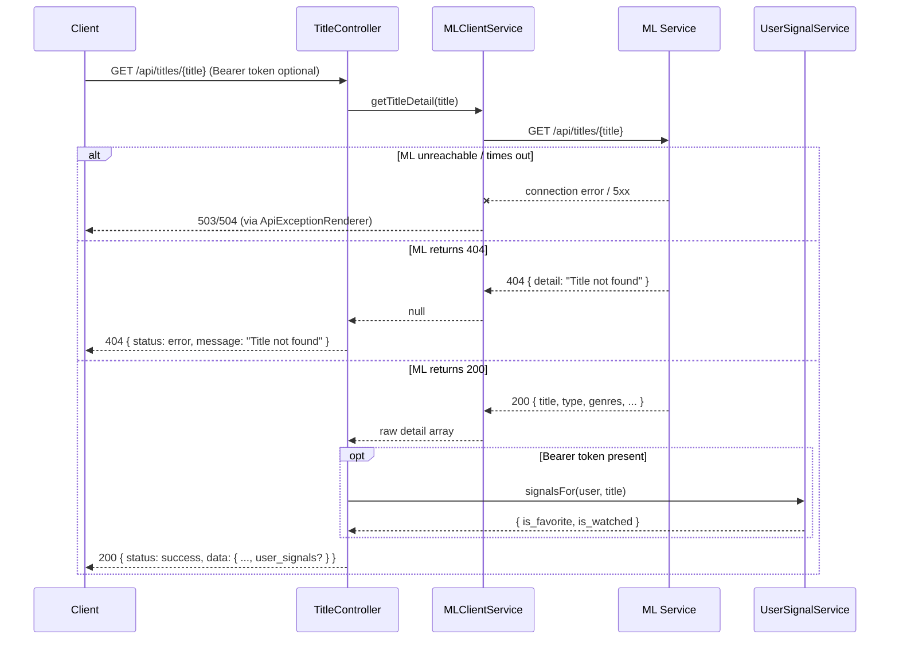

# ML Integration Contract — Search & Discovery

**Audience:** AI/ML Engineer implementing or maintaining the ML service (`ml/recommender_service.py` and its FastAPI wrapper).
**Backend feature:** Search & Discovery (`docs/features/01_feature-search-discovery/`)
**Backend files implementing this contract:**
- `app/Http/Controllers/Api/SearchController.php`
- `app/Http/Controllers/Api/TitleController.php`
- `app/Services/MLClientService.php` (methods: `search()`, `getTitleDetail()`, `getRecommendations()`)
- `app/Http/Requests/SearchRequest.php`
- `app/Http/Resources/Search/SearchResultResource.php`, `TitleDetailResource.php`, `RecommendationResource.php`, `RecommendationItemResource.php`
- `app/Services/UserSignalService.php`

This document covers **three independent endpoints** exposed by the Backend, all of which call the ML layer directly (no caching, no batching, one ML call per Backend request).

---

## 1. Feature Overview

Search & Discovery lets a client (a) autocomplete a title name as the user types, (b) fetch full metadata for a single title, and (c) fetch similar-title recommendations for a single title. The Backend owns no title data itself — every title, its metadata, and its similarity relationships to other titles live exclusively in the ML layer's dataset. The Backend's job is: validate the incoming HTTP request, forward it to the ML service, reshape the ML response into the Backend's public API contract, optionally enrich it with the authenticated user's own signals (`is_favorite` / `is_watched`), and return it.

The ML model solves the problem the Backend cannot solve on its own: fuzzy/partial title matching (autocomplete, "find the title the user probably means"), and content-based similarity ranking (recommendations). The Backend has no independent knowledge of what titles exist or which titles are similar to which — the ML response **is** the source of truth for all three endpoints.

---

## 2. Backend → ML Request

### 2.1 Endpoint A — Autocomplete: `GET /api/search`

- **Triggering Backend endpoint:** `GET /api/search` (public, no auth)
- **Backend controller:** `App\Http\Controllers\Api\SearchController::__invoke()`
- **Backend service method called:** `MLClientService::search(string $query, int $limit = 12)`
- **ML endpoint called:** `GET {ML_BASE_URL}/api/search`
- **When executed:** On every request to `GET /api/search` that passes `SearchRequest` validation. Exactly one ML call per Backend request. Not cached, not batched.
- **Skipped when:** The incoming request fails validation (`q` missing, `q` shorter than 2 characters, or `limit` outside `1–20`) — in that case the ML layer is never called; the Backend returns `422` immediately.

### 2.2 Endpoint B — Title Detail: `GET /api/titles/{title}`

- **Triggering Backend endpoint:** `GET /api/titles/{title}` (public, no auth; optional Bearer token for personalization)
- **Backend controller:** `App\Http\Controllers\Api\TitleController::show()`
- **Backend service method called:** `MLClientService::getTitleDetail(string $title)`
- **ML endpoint called:** `GET {ML_BASE_URL}/api/titles/{title}`
- **When executed:** On every request to this endpoint. Exactly one ML call. Not cached, not batched.
- **Skipped when:** Never skipped — there is no validation layer in front of this endpoint (the `{title}` path segment is used as-is).

### 2.3 Endpoint C — Recommendations: `GET /api/recommendations/{title}`

- **Triggering Backend endpoint:** `GET /api/recommendations/{title}` (public, no auth; optional Bearer token for personalization)
- **Backend controller:** `App\Http\Controllers\Api\TitleController::recommendations()`
- **Backend service method called:** `MLClientService::getRecommendations(string $title, int $n = 10)`
- **ML endpoint called:** `GET {ML_BASE_URL}/api/recommend/{title}`
- **When executed:** On every request to this endpoint. Exactly one ML call. Not cached, not batched.
- **Skipped when:** Never skipped — there is no validation layer in front of this endpoint.

### 2.4 Shared HTTP client configuration

All three calls go through the same private `MLClientService::client()` factory:

```php
Http::baseUrl(config('services.ml.base_url'))->timeout(config('services.ml.timeout'))
```

- `ML_BASE_URL` — env var, default `http://localhost:8000`
- `ML_TIMEOUT` — env var, default `10` (seconds)
- No `Accept` header is explicitly set by the Backend. No `Authorization` header, API key, or credential of any kind is sent to the ML service — the ML service is trusted as an internal-network dependency, not authenticated per-request.
- All three are plain synchronous `GET` requests (no request body).

---

## 3. Request Payload

### 3.1 `GET /api/search`

| Property | Value |
|---|---|
| HTTP Method | `GET` |
| Content-Type | N/A (no body) |
| Authentication | None sent to ML |
| Headers | None beyond Guzzle/Laravel HTTP client defaults |

**Query Parameters**

| Field | Type | Required | Allowed values | Description |
|---|---|---|---|---|
| `q` | string | Yes | any string, Backend-validated to be ≥ 2 characters | The partial/full title string to autocomplete against |
| `limit` | integer | No (defaults to `12`) | Backend-validated `1–20` if provided | Max number of autocomplete results to return |

**Example request:** `GET {ML_BASE_URL}/api/search?q=Breaking&limit=12`

**Backend-side validation before this request is ever sent** (`SearchRequest::rules()`):
```php
'q' => ['required', 'string', 'min:2'],
'limit' => ['sometimes', 'integer', 'min:1', 'max:20'],
```
If this validation fails, the ML service is **never called** — the Backend responds `422` on its own. The ML service should still defend `q < 2` chars on its own side (per `ml/API_CONTRACT.md` it returns `422`) as a second line of defense, but the Backend's own client currently **does not specially handle a 422 from the ML service on this endpoint** (see §5/§6).

### 3.2 `GET /api/titles/{title}`

| Property | Value |
|---|---|
| HTTP Method | `GET` |
| Content-Type | N/A (no body) |
| Authentication | None sent to ML |

**Path Parameter**

| Field | Type | Required | Description |
|---|---|---|---|
| `title` | string (URL segment) | Yes | The title name to resolve, taken verbatim from the Backend's own route segment and forwarded as-is (Laravel does not URL-encode it specially beyond standard URI construction) |

**Example request:** `GET {ML_BASE_URL}/api/titles/The Crown`

No query parameters. No request body. No Backend-side validation exists for this path parameter — whatever string arrives in the Backend's URL is forwarded unmodified.

### 3.3 `GET /api/recommendations/{title}` → ML `/api/recommend/{title}`

| Property | Value |
|---|---|
| HTTP Method | `GET` |
| Content-Type | N/A (no body) |
| Authentication | None sent to ML |

**Path Parameter**

| Field | Type | Required | Description |
|---|---|---|---|
| `title` | string (URL segment) | Yes | The seed title to generate recommendations for, forwarded verbatim |

**Query Parameters**

| Field | Type | Required | Allowed values | Description |
|---|---|---|---|---|
| `n` | integer | No (defaults to `10`) | Not validated by the Backend — whatever the client sends via `?n=` is cast with `(int)` and forwarded as-is, including `0` or negative values | Number of recommendations requested |

**Example request:** `GET {ML_BASE_URL}/api/recommend/Stranger Things?n=10`

**Important:** the Backend applies **no validation** to `n` on this endpoint (unlike `limit` on `/api/search`). A client can send `?n=999` or `?n=-5` or `?n=abc` (which casts to `0` via PHP's `(int)`), and the Backend forwards it to the ML service unchanged. The ML layer's own contract (`ml/API_CONTRACT.md`) documents `n` as clamped `1–50` internally — **the ML service must defend this itself**; the Backend performs no clamping.

---

## 4. Expected ML Response

### 4.1 `GET /api/search` → `200 OK`

```json
{
  "results": [
    { "title": "Breaking Bad", "type": "TV Show", "release_year": 2008 },
    { "title": "Better Call Saul", "type": "TV Show", "release_year": 2015 }
  ]
}
```

| Field | Type | Required | Nullable | Description |
|---|---|---|---|---|
| `results` | array of objects | Yes (see §5 for what happens if absent) | No | List of matched titles, ordered as the Backend will display them (exact-match first is expected by convention, not enforced by the Backend) |
| `results[].title` | string | Yes | No | Exact title string, canonical casing |
| `results[].type` | string | Yes | No | Must be exactly `"Movie"` or `"TV Show"` (see §10 — the Backend elsewhere maps these two literal strings to an internal enum; any other string value is passed through in this endpoint's response with no validation, but would break enum mapping in other features that consume the same title) |
| `results[].release_year` | integer | Yes | No | 4-digit year |

The Backend performs **no further transformation** on this array — `SearchResultResource` re-emits exactly `title`, `type`, `release_year` per item, dropping nothing and adding nothing.

### 4.2 `GET /api/titles/{title}` → `200 OK`

```json
{
  "title": "The Crown",
  "type": "TV Show",
  "genres": "British TV Shows, International TV Shows, TV Dramas",
  "rating": "TV-MA",
  "country": "United Kingdom",
  "release_year": 2020,
  "director": "Not Given"
}
```

| Field | Type | Required | Nullable | Description |
|---|---|---|---|---|
| `title` | string | Yes | No | Canonical title string |
| `type` | string | Yes | No | Must be exactly `"Movie"` or `"TV Show"` — this exact literal is fed into `App\Enums\TitleType::fromLabel()` elsewhere in the system (Favorites/Watched Titles) and **throws a `ValueError` if any other string is received** |
| `genres` | string | Yes | No | **Comma-separated string**, not an array (e.g. `"Crime, Drama, Thriller"`). The Backend itself splits this into an array for the client response (see §7) |
| `rating` | string | Yes | No | Content rating string (e.g. `"TV-MA"`, `"PG-13"`) — passed through verbatim |
| `country` | string | Yes | No | Country string — passed through verbatim |
| `release_year` | integer | Yes | No | 4-digit year |
| `director` | string | Yes | No | Free text; the ML dataset uses `"Not Given"` as a sentinel when unknown rather than `null` — the Backend does not special-case this string, it is passed through as-is |

`404 Not Found` — per `ml/API_CONTRACT.md`, body `{"detail": "Title not found"}`. See §5/§6 for exactly how the Backend interprets this status.

### 4.3 `GET /api/recommend/{title}` → `200 OK`

```json
{
  "query": "Stranger Things",
  "matched_title": "Stranger Things",
  "total": 10,
  "results": [
    {
      "rank": 1,
      "title": "Nightflyers",
      "type": "TV Show",
      "genres": "TV Horror, TV Mysteries, TV Sci-Fi & Fantasy",
      "rating": "TV-MA",
      "country": "United States",
      "release_year": 2018,
      "director": "",
      "similarity": 0.9901
    }
  ]
}
```

| Field | Type | Required | Nullable | Description |
|---|---|---|---|---|
| `query` | string | Yes | No | Echo of the title the Backend requested — the Backend does not currently re-emit this field to the client on this endpoint (see §7), but it is read |
| `matched_title` | string | Yes | No | The title ML actually matched (may differ from `query` on partial match) — also not re-emitted to the client on this endpoint |
| `total` | integer | Yes | No | Count of items in `results` — not re-emitted to the client on this endpoint |
| `results` | array of objects | Yes | No | The recommendation list |
| `results[].rank` | integer | Yes | No | ML's own 1-based rank — **read but discarded**; the Backend does not forward `rank` to the client |
| `results[].title` | string | Yes | No | Recommended title's canonical name |
| `results[].type` | string | Yes | No | Must be `"Movie"` or `"TV Show"` |
| `results[].genres` | string | Yes | No | Comma-separated — **discarded** on this endpoint (not forwarded to the client; contrast with §4.2 where genres are forwarded and split) |
| `results[].rating` | string | Yes | No | **Discarded** — not forwarded to the client on this endpoint |
| `results[].country` | string | Yes | No | **Discarded** — not forwarded to the client on this endpoint |
| `results[].release_year` | integer | Yes | No | Forwarded to the client |
| `results[].director` | string | Yes | No | **Discarded** — not forwarded to the client on this endpoint |
| `results[].similarity` | float | Yes | No | Similarity score. The Backend forwards this verbatim as `similarity_score` with **no rounding, no range validation, no clamping**. See §10 for the range the Backend assumes. |

`404 Not Found` — per `ml/API_CONTRACT.md`, body `{"detail": "No title matching '...' found"}`. See §5/§6.

---

## 5. Backend Validation Rules

**The Backend performs almost no structural validation of the ML response body.** It trusts the ML service's JSON shape completely except for the specific checks below. This is a precise description of what is actually implemented — not a recommendation for what should be validated.

### 5.1 `GET /api/search`
- The Backend does **not** check the HTTP status code of the ML response at all for this call.
- It reads `results` via `$response->json('results') ?? []`.
  - If the key `results` is absent, or the response body is not valid JSON, this evaluates to `[]` — the Backend silently returns an **empty result set** to the client with a `200`, not an error.
  - If `results` is present but is not an array (e.g. a string or object), Laravel's resource `collection()` call will behave per whatever PHP allows for the given value; this is not defended against.
  - Individual item fields (`title`, `type`, `release_year`) are accessed directly with no null-checks; a missing field on any item would raise a PHP warning/`TypeError` inside `SearchResultResource`, which is **not caught** and would surface as an uncaught exception → the global exception handler's catch-all → `500`.

### 5.2 `GET /api/titles/{title}`
- The **only** status code the Backend treats specially is `404` — see §6.
- On any other status (`200`, or any 4xx/2xx that is not `404`), the Backend calls `$response->json()` and treats whatever comes back as valid title data.
  - If the body is not valid JSON, `$response->json()` returns `null`. The Backend's own null-check (`if ($detail === null)`) then treats this **identically to a 404** — it returns `Title not found` to the client. This is a real, implemented behavior: **a malformed/empty JSON body on a 200 response is silently reinterpreted as "not found."**
  - If the JSON is valid but missing required fields (e.g. no `type` key), the failure surfaces later and differently depending on which feature consumed it:
    - Search & Discovery's `TitleDetailResource` will throw on the missing array key (uncaught → `500`).
    - Favorites/Watched Titles will throw a PHP `ValueError` from `TitleType::fromLabel()` if `type` is present but is not exactly `"Movie"` or `"TV Show"` (uncaught → `500`).

### 5.3 `GET /api/recommend/{title}`
- Same pattern as §5.2: only `404` is special-cased. Any other status is parsed as success.
- If `results` is absent from the JSON body, downstream code does `array_column($recommendations['results'], 'title')` in `TitleController::recommendations()` — a missing `results` key here throws a PHP warning/`TypeError` (uncaught → `500`).
- Individual result items are trusted to have `title`, `type`, `release_year`, `similarity` — no defensive checks.

**Summary — what the Backend accepts without complaint:** any 2xx/3xx/4xx-other-than-404 response with a JSON body, regardless of whether required fields are present, as long as the specific fields actually *read* by the code path in question exist. **What the Backend rejects/short-circuits on:** a `404` status (treated as "not found" business outcome, not an error) and 5xx server errors (see §6, treated as ML-unavailable).

---

## 6. Error Handling

`MLClientService`'s private `get()` method (shared by `search()`, `getTitleDetail()`, `getRecommendations()`) implements this exact logic:

```php
try {
    $response = $this->client()->get($uri, $query);
} catch (ConnectionException $e) {
    // network-level failure (DNS, connection refused, timeout)
    if (str_contains(strtolower($e->getMessage()), 'timed out') || str_contains(strtolower($e->getMessage()), 'timeout')) {
        throw new MlTimeoutException(...);
    }
    throw new MlConnectionException(...);
}

if ($response->serverError() && $response->status() !== 404) {
    throw new MlConnectionException(...);
}

return $response;
```

| Condition | Backend behavior | HTTP status returned to the Backend's client |
|---|---|---|
| ML service unreachable (connection refused, DNS failure, etc.) | `MlConnectionException` thrown, propagates uncaught out of the controller, caught centrally by `App\Exceptions\ApiExceptionRenderer` | `503`, body `{"status":"error","message":"Service not available right now"}` |
| ML service does not respond within `ML_TIMEOUT` seconds (default 10s) | `MlTimeoutException` thrown, same propagation | `504`, body `{"status":"error","message":"Service took too long"}` |
| ML returns a `5xx` status **other than via connection failure** (i.e. ML responded, but with a server error status) | `MlConnectionException` thrown (any 5xx is treated identically to "ML unavailable") | `503`, same body as above |
| ML returns `404` | **Not an exception.** Treated as a normal "not found" business outcome. `getTitleDetail()`/`getRecommendations()` return `null`; `search()` is unaffected (no 404 case exists for it) | `404`, body `{"status":"error","message":"Title not found"}` (for the title-detail/recommendations endpoints) |
| ML returns any other 4xx (e.g. `400`, `401`, `403`, `409`, `422`, `429`) | **Not an exception, not treated as "not found" either.** The response body is parsed as if it were a successful payload (see §5) | Whatever the (mis)parsed data produces — most likely a `500` from a downstream missing-field error, or garbage data silently returned as `200` if the error body happens to satisfy the fields being read |
| ML returns invalid/non-JSON body on a `200` | `$response->json()` returns `null` → treated as "not found" for title-detail/recommendations; treated as empty results for search | `404` (title/recommendations) or `200` with empty list (search) |
| ML response body is valid JSON but missing a field the Backend actually dereferences | Uncaught PHP error/exception, caught by the exception handler's catch-all | `500`, body `{"status":"error","message":"..."}` (real exception message outside production, `"Something went wrong"` in production) |

**Note on where this handling happens:** as of the Security Hardening phase, none of these three endpoints' controllers contain a `try`/`catch` around the ML call anymore. `MlConnectionException`/`MlTimeoutException` are allowed to propagate naturally and are caught **once, centrally**, by `App\Exceptions\ApiExceptionRenderer` (registered in `bootstrap/app.php`). This is a deliberate architectural choice — see `docs/security_hardening/`.

---

## 7. Backend Post-processing

### 7.1 `GET /api/search`
- No filtering, ranking, merging, deduplication, or limiting. The ML response's `results` array is passed through `SearchResultResource::collection()` in the same order ML returned it, 1:1.
- No user-signal enrichment on this endpoint (no `is_favorite`/`is_watched`).

### 7.2 `GET /api/titles/{title}`
- **Genre splitting:** `genres` arrives from ML as a single comma-separated string (e.g. `"Crime, Drama, Thriller"`). The Backend splits it: `explode(',', $genres)`, trims whitespace from each piece, filters out empty strings, and re-indexes as a plain array: `["Crime", "Drama", "Thriller"]`. This is the **only** field-level transformation on this endpoint.
- **User signal enrichment (conditional):** if the request carries a valid Bearer token, `UserSignalService::signalsFor($user, $detail['title'])` runs two `EXISTS`-style queries against the authenticated user's own `favorites` and `watched_titles` tables (matched by exact `title_name` string equality against the ML-returned `title`, case-sensitive) and appends a `user_signals: {is_favorite, is_watched}` object to the response. For guests (no token), this key is **omitted entirely** from the response — not `null`, absent.

### 7.3 `GET /api/recommendations/{title}`
- **Field pruning:** `genres`, `rating`, `country`, `director`, and `rank` from each ML result item are read into memory but **never forwarded** to the client. Only `title`, `type`, `release_year`, and `similarity` (renamed to `similarity_score`) survive.
- **No re-ranking, no re-sorting, no deduplication, no filtering against watched/favorited titles** — this endpoint returns the ML service's own ordering and full result set (up to whatever `n` was requested) untouched, unlike the Home feature (see `home.md`) which does perform this filtering.
- **User signal enrichment (conditional, batched):** if authenticated, `UserSignalService::signalsForMany($user, $titles)` runs exactly 2 queries total (one `whereIn` for favorites, one for watched titles across all result titles at once — not one query per item) and attaches a per-item `user_signals` object. For guests, `user_signals` is omitted from every item.

---

## 8. Performance Notes

- **No caching** is applied to any of these three ML calls (contrast with the Home feature, which caches per-title for 24h). Every request to `/api/search`, `/api/titles/{title}`, or `/api/recommendations/{title}` results in exactly one live HTTP call to the ML service.
- **No parallelism** — each endpoint issues a single synchronous `GET`, there is nothing to parallelize (one seed title per request).
- **No retry strategy** — a single failed attempt (timeout or connection error) immediately surfaces as an error to the client; there is no automatic retry.
- **No request batching** on these endpoints (contrast with Home's `getManyTitleDetails`/`getManyRecommendations`).
- Rate limiting on these routes is enforced Backend-side only (`throttle:public`, 60 requests/minute per IP) — this has no bearing on the ML service itself, which receives one request per allowed Backend request.

---

## 9. Sequence Diagram

### `GET /api/search`

```mermaid
sequenceDiagram
    participant Client
    participant SearchController
    participant SearchRequest
    participant MLClientService
    participant ML as ML Service
    Client->>SearchController: GET /api/search?q=..&limit=..
    SearchController->>SearchRequest: validate (q required, min:2; limit 1-20)
    alt validation fails
        SearchRequest-->>Client: 422 { status: error, message }
    else validation passes
        SearchController->>MLClientService: search(q, limit)
        MLClientService->>ML: GET /api/search?q=..&limit=..
        alt ML unreachable
            ML--xMLClientService: connection error
            MLClientService-->>Client: 503/504 (via ApiExceptionRenderer)
        else ML responds
            ML-->>MLClientService: 200 { results: [...] }
            MLClientService-->>SearchController: array of raw items (or [] if malformed)
            SearchController-->>Client: 200 { status: success, data: [...] }
        end
    end
```

### `GET /api/titles/{title}` and `GET /api/recommendations/{title}`



---

## 10. Backend Expectations

The Backend's code is written assuming the following. Deviating from any of these will either produce visibly wrong data to end users or an uncaught `500` — the Backend does **not** gracefully degrade on these three endpoints (unlike Home).

- **`type` is always exactly the literal string `"Movie"` or `"TV Show"`** (case-sensitive, no other casing or synonym) — this exact string round-trips into `App\Enums\TitleType::fromLabel()` elsewhere in the system and throws if it doesn't match one of these two values.
- **`genres` on the title-detail endpoint is always a single string**, comma-separated, never an array, never `null`, never an empty string (an empty string would produce an empty genres array client-side, which is technically handled by the `filter()` call but is not a designed-for case).
- **`release_year` is always an integer** (a 4-digit year), never a string, never `null`.
- **`similarity` on recommendation items is a float.** The Backend assumes but does not enforce a `0.0–1.0` range; it is passed through verbatim with no clamping. Values outside this range would not error but would produce a nonsensical `similarity_score` in the client response.
- **`results` arrays are always present** in `/api/search` and `/api/recommend/{title}` responses on `200` — their absence is tolerated only on `/api/search` (defaults to empty); on `/api/recommend/{title}` a missing `results` key causes an uncaught error.
- **Response ordering is preserved as ML returns it** — the Backend does not re-sort any of these three endpoints' results. If ranking matters, ML must return results in the desired final order.
- **`404` is the only status code that means "not found."** Any other non-2xx, non-5xx status is not specially interpreted and will likely produce corrupted or error responses downstream — ML should not use `400`/`422`/`409`/etc. to signal "title not found" on the detail/recommendation endpoints.
- **Character encoding is UTF-8** throughout (standard JSON/Laravel assumption, not explicitly negotiated via headers).
- **No maximum response size is enforced by the Backend** — an unbounded `results` array would be accepted and only capped implicitly by whatever `limit`/`n` the client requested and ML honored.
- **The ML service is trusted infrastructure** — no signature, token, or credential is presented by the Backend, and none is expected back.

---

## 11. Integration Checklist

For the AI/ML Engineer validating a new or updated ML service build against this contract:

- [ ] `GET /api/search?q=X&limit=N` returns `200` with a top-level `results` array (present even when empty: `{"results": []}`, not an omitted key)
- [ ] Every `/api/search` result item has exactly `title` (string), `type` (`"Movie"` or `"TV Show"` only), `release_year` (integer)
- [ ] `GET /api/titles/{title}` returns `200` with exactly the 7 documented fields (`title`, `type`, `genres`, `rating`, `country`, `release_year`, `director`) when the title exists
- [ ] `genres` on `/api/titles/{title}` is a comma-separated **string**, not a JSON array
- [ ] `GET /api/titles/{title}` returns `404` (any JSON body) when the title does not exist — not `200` with an empty/null body, not `400`/`422`
- [ ] `GET /api/recommend/{title}?n=N` returns `200` with `query`, `matched_title`, `total`, and a `results` array
- [ ] Every `/api/recommend/{title}` result item has `rank`, `title`, `type`, `genres`, `rating`, `country`, `release_year`, `director`, `similarity` — even though the Backend currently only forwards `title`/`type`/`release_year`/`similarity` to the client, all 9 fields must be present or downstream consumers reading additional fields in the future will break
- [ ] `similarity` is numeric (float), roughly in `0.0–1.0`
- [ ] `GET /api/recommend/{title}` returns `404` when the seed title does not exist
- [ ] The service responds within `ML_TIMEOUT` seconds (Backend default `10s`) under normal load — slower responses surface to end users as `504`
- [ ] All responses are valid JSON with `Content-Type: application/json` (or a type Laravel's `Http` client will still parse as JSON)
- [ ] No endpoint ever returns a `5xx` for a normal "not found" case — only for genuine server errors (the Backend treats **all** `5xx` as "ML is down," not as a business error)
- [ ] `type` values are exactly `"Movie"` / `"TV Show"` with no trailing whitespace or alternate casing
- [ ] Empty `results: []` arrays are handled distinctly from a missing/malformed body — an empty array is a valid, successful "no matches" response; malformed JSON is silently reinterpreted as "not found" by the Backend, which is almost certainly not the intended signal
