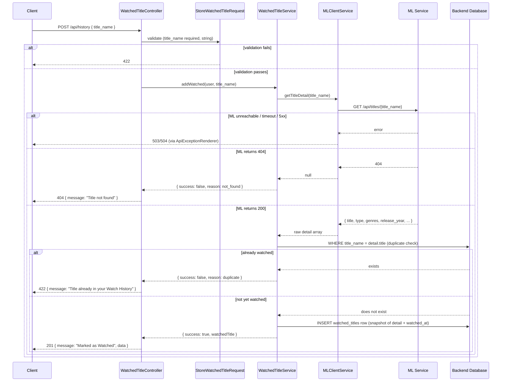

# ML Integration Contract — Watched Titles

**Audience:** AI/ML Engineer implementing or maintaining the ML service (`ml/recommender_service.py` and its FastAPI wrapper).
**Backend feature:** Watched Titles (`docs/features/03_feature-watched-titles/`)
**Backend files implementing this contract:**
- `app/Http/Controllers/Api/WatchedTitleController.php`
- `app/Services/WatchedTitleService.php`
- `app/Services/MLClientService.php` (method: `getTitleDetail()`)
- `app/Http/Requests/StoreWatchedTitleRequest.php`
- `app/Http/Resources/WatchedTitleResource.php`
- `app/Enums/TitleType.php`

Only **one** of the three Watched Titles endpoints talks to the ML layer: `POST /api/history`. `GET /api/history` and `DELETE /api/history/{title_name}` never call ML — they operate purely on data already stored in the Backend's own database.

This feature's ML integration is **structurally identical** to Favorites (`favorites.md`) — same single ML method, same request/response shape, same error handling, same snapshot-at-write pattern. This document is intentionally self-contained (not a diff against Favorites) so the AI Engineer does not need to cross-reference two files to fully implement either one. Every difference from Favorites is called out explicitly where it occurs.

---

## 1. Feature Overview

Watched Titles lets an authenticated user mark a title as watched, building a personal watch history independent of their Favorites list (a title can be watched, favorited, both, or neither — these are two completely independent systems, per `docs/features/03_feature-watched-titles/01_feature_analysis/01_User_Scenarios.svg`). As with Favorites, the Backend has no independent catalog of valid titles — it must consult the ML layer to (a) confirm the title exists and (b) resolve its canonical metadata before writing a watch-history row.

The ML model solves the same two problems as it does for Favorites: title existence validation, and canonical metadata resolution for an arbitrary user-typed title string.

---

## 2. Backend → ML Request

- **Triggering Backend endpoint:** `POST /api/history` (protected — requires a valid Bearer/JWT token)
- **Backend controller:** `App\Http\Controllers\Api\WatchedTitleController::store()`
- **Backend service that calls ML:** `App\Services\WatchedTitleService::addWatched(User $user, string $titleName)`
- **Backend service method called:** `MLClientService::getTitleDetail(string $title)`
- **ML endpoint called:** `GET {ML_BASE_URL}/api/titles/{title}`
- **When executed:** On every `POST /api/history` request that passes `StoreWatchedTitleRequest` validation (`title_name` present and a string). The ML call is the first thing `addWatched()` does — before any database read or write.
- **Skipped when:**
  - Request fails validation — ML is never called, Backend returns `422` immediately.
  - There is **no** short-circuit for an already-watched title — the ML call always happens first; the duplicate check happens locally, after the ML response returns (see §7).

Snapshot-at-write: `type`, `genres`, `release_year` are copied from the ML response into the `watched_titles` table at creation and never re-fetched. `GET /api/history` reads only the stored snapshot.

---

## 3. Request Payload

### 3.1 Backend's own inbound contract (client → Backend)

| Property | Value |
|---|---|
| HTTP Method | `POST` |
| Endpoint | `/api/history` |
| Content-Type | `application/json` |
| Authentication | Required — `Authorization: Bearer {jwt}` |

```json
{
  "title_name": "Better Call Saul"
}
```

| Field | Type | Required | Description |
|---|---|---|---|
| `title_name` | string | Yes | The title the client wants to mark as watched |

**Backend validation** (`StoreWatchedTitleRequest::rules()`):
```php
'title_name' => ['required', 'string'],
```
Identical rule set to Favorites — no length or format constraints beyond "must be a string."

### 3.2 Backend → ML request

| Property | Value |
|---|---|
| HTTP Method | `GET` |
| Content-Type | N/A (no body) |
| Authentication | None sent to ML |

**Path Parameter**

| Field | Type | Required | Description |
|---|---|---|---|
| `title` | string (URL segment) | Yes | The client's raw `title_name` input, forwarded verbatim |

**Example request:** `GET {ML_BASE_URL}/api/titles/Better Call Saul`

No query parameters.

---

## 4. Expected ML Response

`200 OK`:

```json
{
  "title": "Better Call Saul",
  "type": "TV Show",
  "genres": "Crime, Drama",
  "rating": "TV-MA",
  "country": "United States",
  "release_year": 2015,
  "director": "Not Given"
}
```

| Field | Type | Required | Nullable | Used by this feature? |
|---|---|---|---|---|
| `title` | string | Yes | No | **Yes** — becomes the canonical `title_name` stored (not the user's raw input — see §7) |
| `type` | string | Yes | No | **Yes** — must be exactly `"Movie"` or `"TV Show"`; mapped to `App\Enums\TitleType` |
| `genres` | string | Yes | No | **Yes** — stored verbatim as the comma-separated string, unsplit |
| `rating` | string | Yes | No | **No** — ignored |
| `country` | string | Yes | No | **No** — ignored |
| `release_year` | integer | Yes | No | **Yes** — stored as-is |
| `director` | string | Yes | No | **No** — ignored |

`404 Not Found` — body per `ml/API_CONTRACT.md`: `{"detail": "Title not found"}`. The Backend does not read the body of a 404.

---

## 5. Backend Validation Rules

Identical logic to Favorites (`favorites.md` §5):

- Only `404` is treated specially (see §6).
- Any non-`404`, non-`5xx` status → `$response->json()` is parsed unconditionally as valid title data.
- `WatchedTitleService::addWatched()`:
  ```php
  $detail = $this->mlClientService->getTitleDetail($titleName);
  if ($detail === null) {
      return ['success' => false, 'reason' => 'not_found'];
  }
  ```
  A malformed/non-JSON `200` body → `null` → treated identically to `404`.
- Fields actually dereferenced (only these are effectively "required" in practice): `title`, `type`, `genres`, `release_year`.
  - Missing `title`/`genres`/`release_year` → uncaught PHP error on missing array key → `500`.
  - Missing or unrecognized `type` → `App\Enums\TitleType::fromLabel()` throws `ValueError` → `500`.
- No type-checking beyond what's implied by usage — a non-integer `release_year` or non-string `genres` is not explicitly rejected before the database write is attempted.

---

## 6. Error Handling

Identical error-handling matrix to Favorites (`favorites.md` §6), reproduced here for completeness:

| Condition | Backend behavior | HTTP status returned to the Backend's client |
|---|---|---|
| ML unreachable | `MlConnectionException`, propagates uncaught, caught centrally by `App\Exceptions\ApiExceptionRenderer` | `503`, `{"status":"error","message":"Service not available right now"}` |
| ML times out (> `ML_TIMEOUT`, default 10s) | `MlTimeoutException`, same propagation | `504`, `{"status":"error","message":"Service took too long"}` |
| ML returns any `5xx` | Treated as "unreachable" | `503`, same as above |
| ML returns `404` | `getTitleDetail()` returns `null` → `addWatched()` returns `['success' => false, 'reason' => 'not_found']` | `404`, `{"status":"error","message":"Title not found"}` |
| ML returns any other 4xx (`400`, `401`, `403`, `409`, `422`, `429`) | Not treated as an error — body parsed as if valid | Likely `500` from a missing-field error, or worst-case a watch-history row silently created from garbage data |
| ML returns invalid/non-JSON body on `200` | `null` → treated as `not_found` | `404`, `{"status":"error","message":"Title not found"}` |
| Valid JSON, required field missing or `type` unrecognized | Uncaught error → global exception handler catch-all | `500` |

No graceful degradation — same as Favorites, this is a write path requiring authoritative ML data. If ML is down, marking a title as watched fails outright for the duration of the outage.

---

## 7. Backend Post-processing

`WatchedTitleService::addWatched()`, in order:

1. **Canonicalization:** the watched-title row is keyed by `$detail['title']` (ML's canonical title), not the raw client input.
2. **Duplicate check (post-ML, pre-write):** `$user->watchedTitles()->where('title_name', $detail['title'])->exists()`, matched against the ML-resolved canonical title. If found, returns `['success' => false, 'reason' => 'duplicate']` without writing — and without the preceding ML call having been avoidable (it always runs first, same as Favorites).
3. **Type mapping:** `App\Enums\TitleType::fromLabel($detail['type'])`.
4. **Snapshot write:** new `watched_titles` row with `title_name`, `title_type`, `genres` (raw string, unsplit), `release_year` from ML, plus `watched_at = now()` (Backend-generated) and `user_id`.
5. No filtering, ranking, merging, sorting, or deduplication beyond the single duplicate check — single-item write.

**The only functional difference from Favorites' post-processing:** the timestamp column is named `watched_at` instead of `added_at`, and the target table/relationship is `watchedTitles()` instead of `favorites()`. The transformation logic applied to the ML response itself is byte-for-byte identical.

---

## 8. Performance Notes

- **No caching** — every `POST /api/history` triggers exactly one live ML call.
- **No parallelism** — single title, single request.
- **No retry strategy.**
- **No batching** — single-item write endpoint.
- Rate limiting is Backend-side only (`throttle:protected`, 100 requests/minute per authenticated user).

---

## 9. Sequence Diagram



---

## 10. Backend Expectations

Identical to Favorites (`favorites.md` §10):

- **`type` must be exactly `"Movie"` or `"TV Show"`** — anything else throws an uncaught `ValueError`, producing a `500` and failing the mark-as-watched action.
- **`genres` must be a string** — persisted verbatim, no format validation.
- **`release_year` must be an integer** (or coercible to one).
- **`title` is the single source of truth** for canonical naming — must be stable and consistent across repeated calls for the same logical title, since it drives duplicate detection and title-based removal (`DELETE /api/history/{title_name}` matches by exact `title_name` string).
- **`404` is the only status meaning "does not exist."**
- **No fallback if ML is unavailable** — the Backend cannot mark a title as watched without ML confirming it exists.

---

## 11. Integration Checklist

- [ ] `GET /api/titles/{title}` returns `200` with `title`, `type`, `genres`, `release_year` present (this feature ignores `rating`, `country`, `director`, but per `search-discovery.md` they must still be present for other consumers)
- [ ] `type` is exactly `"Movie"` or `"TV Show"`
- [ ] `genres` is a comma-separated string, not an array, not `null`
- [ ] `release_year` is a JSON integer
- [ ] `title` has stable, consistent canonical casing across repeated calls (affects duplicate detection and later removal-by-title-name)
- [ ] `GET /api/titles/{title}` returns `404` for titles that don't exist — not `200` with empty/null body
- [ ] Partial-match resolution returns the full canonical title, not an echo of the user's partial input
- [ ] Response time consistently within `ML_TIMEOUT` (default 10s) — this blocks the user-facing "mark as watched" action synchronously
- [ ] No `5xx` returned for a legitimate "not found" case
